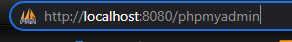
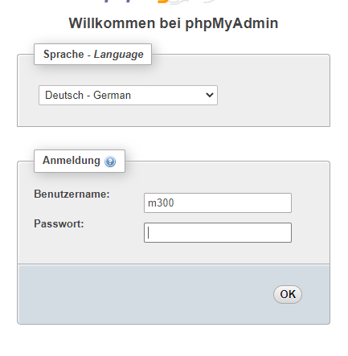
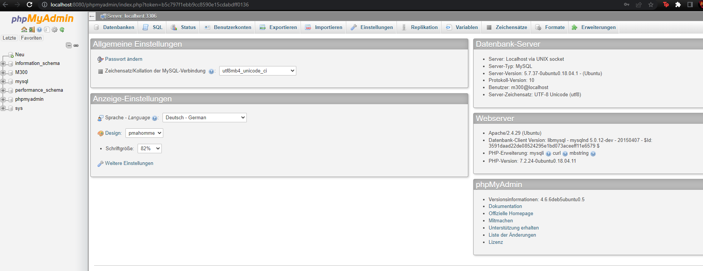
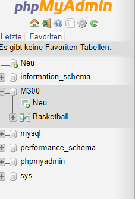
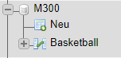
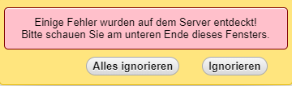
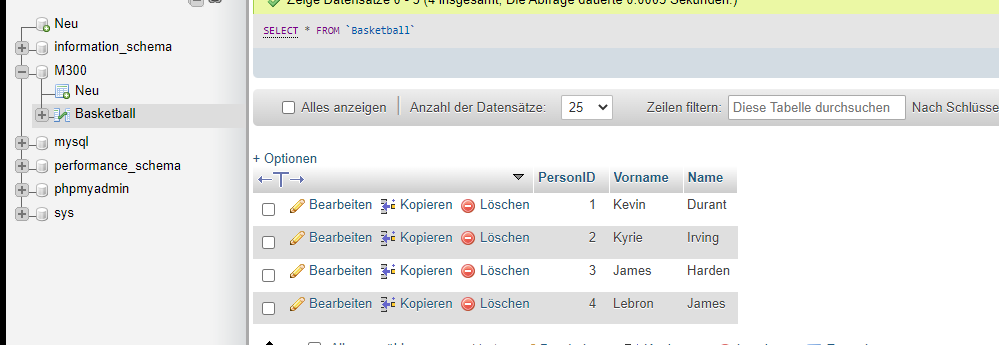

# M300

## Inhaltsverzeichnis

- [Einleitung](#einleitung)
    - [Voraussetzungen](#voraussetzungen)
- [Umgebung](#umgebung)
	- [Webserver](#Webserver)
- [Wie man die Umgebung steuern](#umgebung-steuern)
    - [Hochfahren](#hochfahren)
    - [Herunterfahren](#herunterfahren)
    - [Umgebung löschen](#umgebung-löschen)
    - [Befehl-Tabelle Vagrant](#befehl-tabelle-vagrant)
    - [Apache](#apache)
    - [MYsql](#mysql)
- [Zugreifen auf den Webserver](#zugreifen-auf-den-webservern)
- [Exit](#exit)
- [Quellen](#quellen)

---

## Einleitung

Diese Dokumentation ist für die LB2 vom Modul 300 (Plattformübergreifende Dienste in ein Netzwerk integrieren). In dieser LB2 handelt es sich um Vagrant und der Umgang damit, sowie der Umgang mit Markdown. Die Aufgabe ist durch Vagrant, Vms zu erstellen auf dem ein oder mehrere Services laufen. Ich habe mich auf eine VM beschränkt und auf dieser sollte Apache und MYsql laufen. Das Ziel ist es über den Webserver und einem Anmeldefenster die Tabelle von MYsql zusehen. 

>### Voraussetzungen>

- Vagrant muss auf dem Notebook laufen
- neuste Version von Virtualbox haben
- Notebook mit mindestens 8GB RAM
- Github konto

---

## Umgebung Aufbau

Einen Webserver in dem man sich anmelden kann und auf die Datenbank zugreifen kann. 

### Webserver
- **Webserver:**
Wenn man auf folgenden Link geht http://localhost:8080/phpmyadmin kommt man auf ein Anmeldefenster. In diesem gibt man die Benutzer Daten an um auf die phpMyAdmin Seite zugelangen und in dieser wird die Datenbank ersichtlich. 
> **NOTE:** Username und Passwort + Anleitung werden noch angegeben

---

## Wie man die Umgebung steuern

### Hochfahren:

Um die Umgebung hochzufahren müssen folgende Punkte beachtet werden: 
- GitBash starten
- In den Ordner navigieren, wo sich das Vagrant File befindet
- Ist man soweit mit **vagrant up** den Prozess starten
Ganz wichtig nach dem ausführen sollte man geduldig warten da es einige Zeit dauern kann bis es durchgelaufen ist. 

### Herunterfahren:

Um die Umgebung herunterzufahren müssen folgende Punkte beachtet werden: 
- In den Ordner navigieren, wo sich das Vagrant File befindet
- Ist man soweit mit **vagrant halt** wird die Umgebung heruntergefahren
Dies sollte schneller als das hochfahren gehen.

### Umgebung vom Gerät löschen:

Um die Umgebung zulöschen müssen folgende Punkte beachtet werden: 
- In den Ordner navigieren, wo sich das Vagrant File befindet
- Ist man soweit mit **vagrant destroy** wird die Umgebung heruntergefahren
 
> **NOTE:** Man muss bei den Maschinen die beide Male **"y"** eingeben, um zu bestätigen, dass man die VMs auch wirklich löschen will.

### Vagrant Befehle:

|Befehl    		   |Command                   |
|--------------------------|--------------------------|
|hochfahren / erstellen    |`vagrant up`              |
|herunterfahren            |`vagrant halt`            |
|löschen                   |`vagrant destroy`         |
|Neuladen der Konfiguration|`vagrant reload`          |

## Anleitung
|Vorgehen    		   |Bild                   |
|--------------------------|--------------------------|
| 1. Auf den Link http://localhost:8080/phpmyadmin gehen  		||
| 2. Anmeldefenster ausfühlen mit Daten unterhalb 	  		||
| 3. Befindet man sich auf die Hauptseite                 		||
| 4. Auf der linken Seite im Menü auf M300 drücken	  		||
| 5. Nachdem taucht eine Zeile unterhalb mit Basketball	  		||
| 6. Wenn man darauf drückt kommt eine Fehlermeldung diese Ignorieren	||
| 7. Nachdem sieht man oberhalb die erstellte Tabelle mit den Daten	||

## Benutzernamen und Passwörter

### Webserver

- Benutzername: M300
- Passwort: berger

## Quellen
[Apache_installieren](https://www.digitalocean.com/community/tutorials/how-to-install-the-apache-web-server-on-ubuntu-20-04-de)

[Mysql_installieren](https://www.digitalocean.com/community/tutorials/how-to-install-mysql-on-ubuntu-20-04-de)
